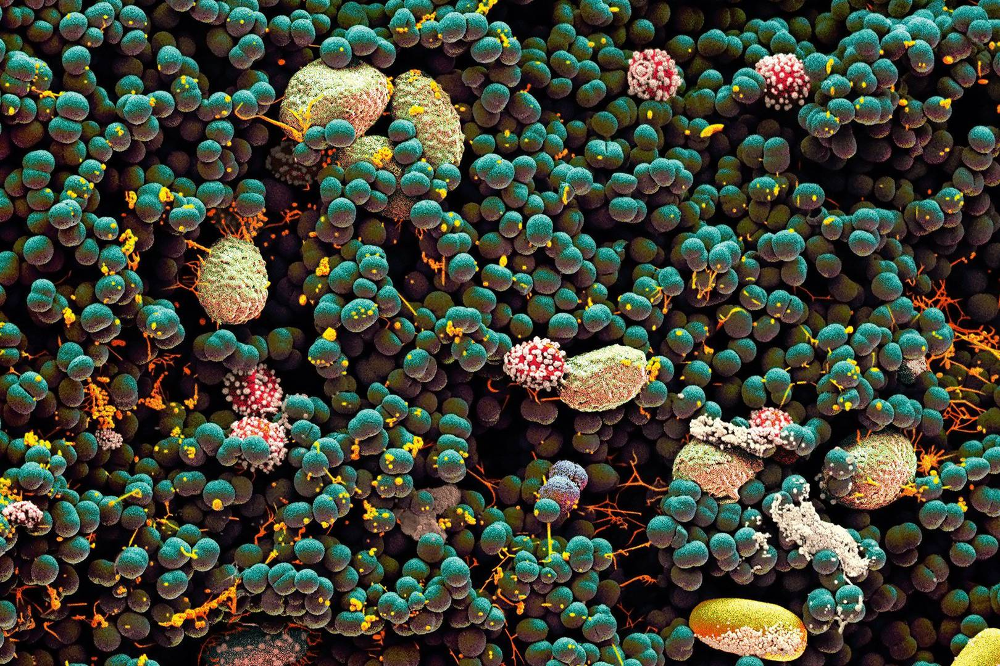

# Biodiversity of the Human Navel

## The Data 

 In January 2011, YourWildLife.org launched [Belly Button Biodiversity](http://robdunnlab.com/projects/belly-button-biodiversity/) to investigate the microbes inhabiting our navels and the factors that might influence the microscopic life calling this protected, moist patch of skin home. Two Belly button biodiversity datasets (.csv) of taxonomic and meta-data matrices were combined into a sql database {bellybutton.sqlite}.

## Task

The technology Plotly Javascript was deployed, which is high-level declarative open source graphing library, to build an interactive dashboard to explore the Belly Button Biodiversity DataSet.

* Creatd a PIE chart that used data from samples route (`/samples/<sample>`) to display the top 10 samples.

  * Use `sample_values` as the values for the PIE chart

  * Use `otu_ids` as the labels for the pie chart

  * Use `otu_labels` as the hovertext for the chart

  

* Created a Bubble Chart that used data from samples route (`/samples/<sample>`) to display each sample.

  * Use `otu_ids` for the x values

  * Use `sample_values` for the y values

  * Use `sample_values` for the marker size

  * Use `otu_ids` for the marker colors

  * Use `otu_labels` for the text values

  

* Displayed the sample metadata from the route `/metadata/<sample>`

* Updated all of the plots any time that a new sample was selected.

## Flask-SQLAlchemy API

* Created a Flask app object and told it where the SQLAlchemy database file should live. We also create a db object which allowed one to integrate SQLAlchemy into Flask.

* Initialized the database and reflectd an existing database into the new model. Created a new AutomapBase class. Then called AutomapBase.prepare() on the resulting base class, asking it to reflect the schema and produce mappings, matching that of the table name. 

* Created a template called index.html for the plotly dashboard page. Used the Bootstrap grid system to create the structure of the dashboard page.

* Created the routes for the api, as a means to output the data as JSON in the format specified in the routes.

* Used Pandas to perform the sql queries, filter queries and create dictionaries to return jsonified data.

